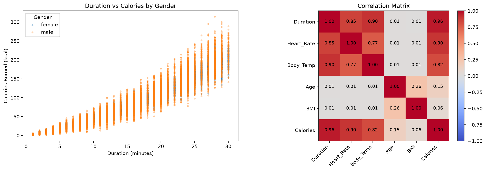
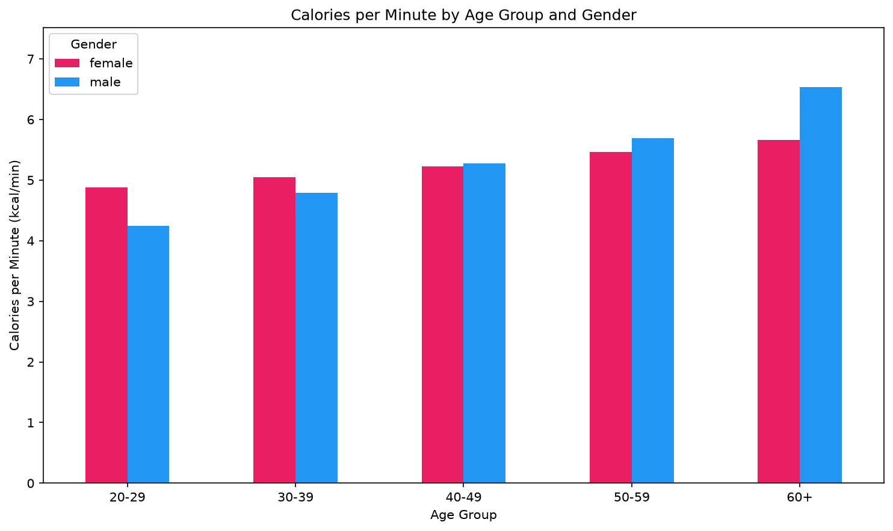
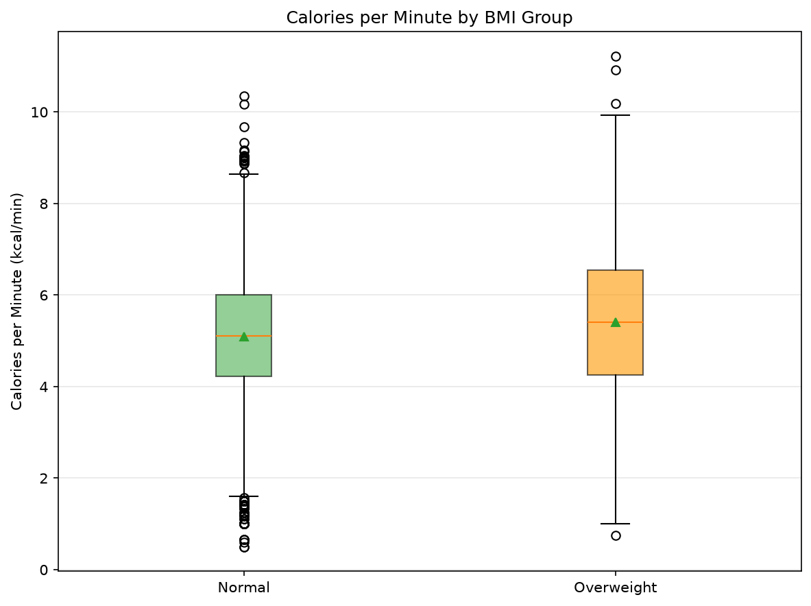

# Fitness Calories EDA

Exploratory data analysis of 15,000 workout sessions: what goes with how many calories a person burns?


## About the Project

Fitness trackers report a calorie number, but what actually goes with it? This project takes two raw CSV files (exercise measurements and calories), validates and merges them, cleans the data, builds a few features, and answers three concrete questions with numbers and charts. Every conclusion is stated as an association in this dataset, never as a cause.

## Preview



## Dataset

| | |
|---|---|
| Files | `exercise.csv` (`User_ID`, `Gender`, `Age`, `Height`, `Weight`, `Duration`, `Heart_Rate`, `Body_Temp`) and `calories.csv` (`User_ID`, `Calories`) |
| Size | 15,000 rows in each file, joined one-to-one on `User_ID` (the ID sets are identical) |
| Ranges | ages 20–79, workout duration 1–30 minutes |
| Source | [13Gitanjali/Calories-burnt-prediction](https://github.com/13Gitanjali/Calories-burnt-prediction) (the original collection process is not documented) |

The raw files are **not** stored in this repository. To re-run the cleaning step, download `exercise.csv` and `calories.csv` from the link above (Code → Download ZIP) and put them in `data/raw/`.
The cleaned dataset **is** committed (`data/processed/cleaned_data.csv`), so the analysis notebook runs without the raw files.

## Questions

1. **Q1.** Do longer workouts and higher heart rates go with more calories burned?
2. **Q2.** Does calories burned per minute differ by gender and age group?
3. **Q3.** Do the Normal and Overweight BMI groups differ in calories burned per minute?

## Methods

### `notebooks/01_cleaning.ipynb`

| Step | What was done |
|---|---|
| Inspect | `head`, `shape`, `info`, `describe` for both files |
| Validate key | `User_ID` is unique in each file and the two ID sets are identical |
| Audit | Table of dtype, missing count, missing %, unique values, plus duplicate check and hidden-missing check (values ≤ 0): no missing values, no duplicates |
| Merge | `inner` join on `User_ID` with `validate="one_to_one"`; row counts checked before and after (15,000 → 15,000) |
| Outliers | IQR and z-score on the numeric columns; outliers were kept, with a written reason per column (values are physiologically plausible) |
| Types | `Gender` converted to `category` |
| Features | `BMI`, `Calories_per_Minute`, `Age_Group`, `BMI_Group` (13 columns in the final table) |
| Output | `data/processed/cleaned_data.csv` |

### `notebooks/02_analysis.ipynb`

- Reads only the cleaned file and restores the ordered `category` columns.
- Pearson correlation, `groupby` with several aggregations, `pivot_table` and `crosstab`, absolute and percentage differences.
- Each question follows the same structure: question → method → numeric answer → chart → conclusion.
- Group comparisons also report average duration and average age per group, to check that the comparison is fair.

## Results

| # | Finding |
|---|---|
| 1 | `Duration` is the strongest correlate of `Calories` (r = 0.955; `Heart_Rate` 0.898, `Body_Temp` 0.825). Mean calories: 24.1 kcal for 1–10 min, 81.4 kcal for 11–20 min, 163.7 kcal for 21–30 min (about 6.8×). |
| 2 | Calories per minute rise with age in every age group: 4.570 kcal/min at 20–29 to 6.098 at 60+ (+1.528 kcal/min, +33.4%). |
| 3 | The overall gender difference is tiny (5.210 vs 5.192 kcal/min) but hides a sign flip: females are higher by 0.634 at 20–29, males are higher by 0.874 at 60+. |
| 4 | Overweight users burn +0.322 kcal/min (+6.33%) more than Normal-BMI users, but they are about 6.7 years older on average (47.2 vs 40.5), so the gap is confounded by age. |

### Q2: calories per minute by age group and gender



Females burn more per minute below age 40, males from 40–49 onward; the near-zero overall gender gap comes from these opposite differences cancelling out.

### Q3: calories per minute by BMI group



The Overweight group has a higher mean, but its average age is higher too, so this is not a pure BMI effect. Only Normal and Overweight users exist in the data.

## NumPy Vectorization Benchmark

Computing BMI for all 15,000 rows, best and mean of 5 runs:

| Method | Best time | Mean time |
|---|---:|---:|
| Python loop | 7.68 ms | 8.23 ms |
| NumPy vectorized | 18.8 µs | 41.7 µs |

Speed-up: **408.6×**, and `np.allclose` confirms both methods give the same result. Timings vary slightly between runs and machines (around 400–460× in my runs). The notebook also standardizes four columns at once with broadcasting: `(X - X.mean(axis=0)) / X.std(axis=0)` on a `(15000, 4)` array.

## Project Structure

```text
fitness-calories-eda/
├── data/
│   ├── raw/                     # not committed, see Dataset
│   └── processed/
│       └── cleaned_data.csv
├── notebooks/
│   ├── 01_cleaning.ipynb
│   └── 02_analysis.ipynb
├── reports/
│   └── figures/
│       ├── q1_duration_vs_calories.png
│       ├── q2_gender_age_cpm.png
│       └── q3_bmi_group_cpm.png
├── requirements.txt
└── README.md
```

## Quick Start

```bash
git clone https://github.com/Sheyda-Fathi/fitness-calories-eda.git && cd fitness-calories-eda
python -m venv venv && venv\Scripts\activate        # macOS/Linux: source venv/bin/activate
pip install -r requirements.txt && jupyter notebook notebooks/02_analysis.ipynb
```

Dependencies are pinned in `requirements.txt` (pandas 3.0.6, NumPy 2.4.6, Matplotlib 3.11.2, seaborn 0.13.2, SciPy 1.17.1). To re-run the cleaning step first, place the raw CSVs in `data/raw/` and open `notebooks/01_cleaning.ipynb`.

## What I Learned

- **Validate before you merge.** I checked that `User_ID` was unique and matched in both files, and used `validate="one_to_one"` so a bad key could not silently duplicate rows.
- **An outlier is not automatically an error.** I flagged outliers with IQR and z-score, checked them against what is physiologically plausible, and wrote down why I kept them.
- **Overall averages can hide structure.** The gender difference looked like zero overall, but it flips sign across age groups. Looking only at the marginal mean would have led to the wrong conclusion.
- **Compare groups fairly.** The BMI gap was partly an age gap, so I reported `avg_age` and `avg_duration` for each group before interpreting the difference.
- **Keep a clean pipeline.** Raw data → cleaning notebook → processed CSV → analysis notebook, re-casting `category` columns after reading the CSV because CSV does not store dtypes.
- **Vectorize.** The same BMI computation ran about 400× faster with NumPy than with a Python loop, and broadcasting removed the need for column-by-column loops.
- **Small, meaningful commits.** I built the project step by step with conventional commit messages, so the history shows the workflow.

## Limitations & Future Work

**Limitations.** The results are observational associations, not causal effects. The data source and collection method are not documented, and some features (body temperature around 40 °C on average during exercise, BMI only between about 19 and 29, whole-minute durations from 1 to 30, ages 20–79) suggest the sample may not represent a typical real-world population, so the findings should not be generalized. There are no Underweight or Obese participants, and the Overweight female subgroup is small (n = 608). Pearson correlation captures only linear relations, and differences are described without significance tests or adjusted models. This is not medical or training advice.

**Future work.**
- Compare BMI groups within age groups, or with a regression that adjusts for age.
- Add confidence intervals or significance tests for the group differences.
- Model `Calories` with regression (linear regression from scratch is the next phase of my roadmap).
- Validate the findings on a dataset with a documented collection process.
